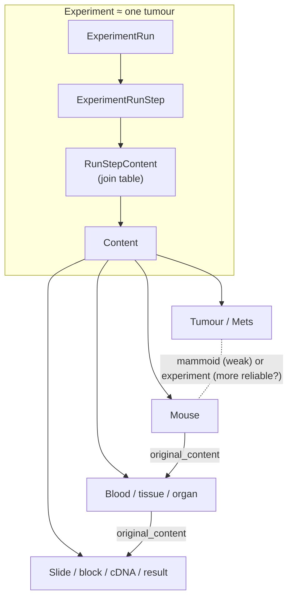

# Xenograft data model

## SLIMS hierarchy

```
Project
  └─ Experiment            xprm_pk, xprm_fk_project, xprm_name
       └─ ExperimentRun     xprn_pk, xprn_fk_experiment
            └─ ExperimentRunStep   xprs_pk, xprs_fk_experimentRun
                 └─ ExperimentRunStepContent   xrsc_fk_experimentRunStep,
                                               xrsc_fk_content
                      └─ Content   cntn_pk
```

`ExperimentRunStepContent` is a pure join table: one row per (run step, content)
pair. **A `Content` record carries no back-reference to the run step that used
it.** If the join table is not walked and stored at snapshot time, the provenance
is not recoverable without re-walking SLIMS. This is why `snapshot.py` fetches
the whole structure before fetching any content, and why the set of content it
fetches at all is exactly the set reachable through this table.

Stored locally as `experiment`, `exp_run`, `exp_runstep`, `runstep_content`, and
`content`. `runstep_content` denormalises `exp_run_pk` and `experiment_pk` onto
each edge so "all content in experiment X" is one indexed lookup rather than a
four-table join.

## Content model

The model shifts from separate domain classes such as Tumour, Mouse, and Assay
to one generic `Content`. Type-specific fields (treatment, results,
mouse-specific information, location) are kept as dynamic attributes in the raw
column dump, while the core row stores only identity, type, and provenance.
Typed views over the `content` table (`content_types.SPEC` →
`store.build_type_views`) project it back into per-type pages.

Each `content` row stores:

| column | source | note |
|---|---|---|
| `pk` | `cntn_pk` | |
| `slims_id` | `cntn_barCode` | |
| `content_type` | `cntn_fk_contentType` | resolved display label, not the fk |
| `mammoid` | `cntn_cf_mammoid` | optional, unreliable outside tumours |
| `original_content` | `cntn_fk_originalContent` | derivation link |
| `slims_link` | derived | deep link into the SLIMS UI |
| `raw_json` | all columns | `{name: {title, value, display, ...}}` |

```jsonc
{
  "pk": 12345,
  "slims_id": "",
  "content_type": "",
  "mammoid": "",
  "original_content": "",
  "raw_json": {
    "cntp_name": {
      "title": "Type",
      "value": "Mouse",
    }
  }
}
```

`display` is the precomputed human-readable scalar the SQL views read; it
resolves `displayValue` → `value`.

`original_content` represents the reliable derivation link. Ancestors, children
and descendants are derived by following it.

`mammoid` remains separate because of its lack of systematicity. It is clean on
tumours and free text on mice, and it is the only link between a mouse and its
tumour of origin (cell line, mammoplasty, metastasis) that does not go through
the experiment hierarchy.

## Both axes together



Solid arrows out of the join table are experiment membership; solid arrows
between content are physical derivation; the dotted line is the mammoid
heuristic.
